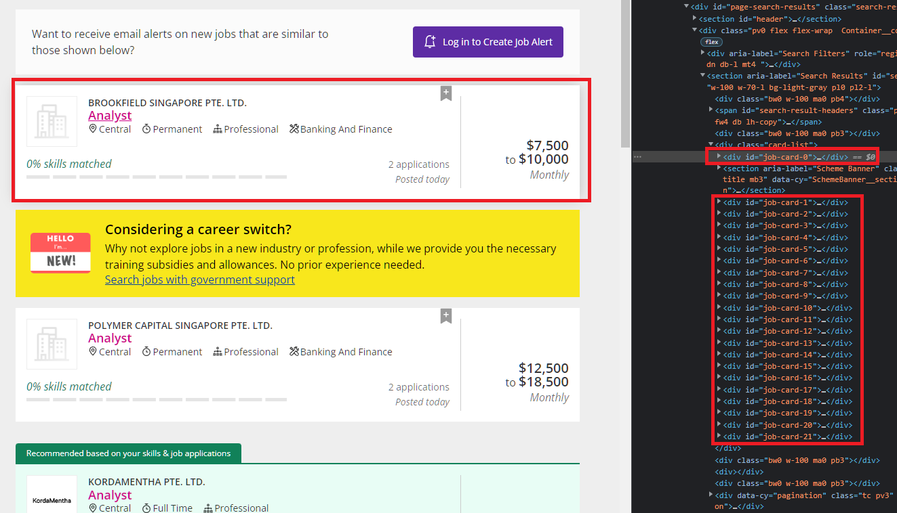

# README

I noticed that the job listings are in the job cards, so information are all pulled using Xpath.




# Runing the scraper

This scraper uses hydra for the argument parsing and uses selenium on the backend.

To run, simply cd to this directory and execute

```
python scrapy settings.search-term=<your search term>
```