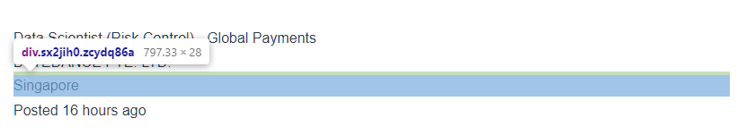
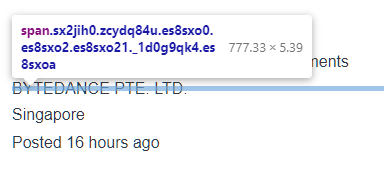
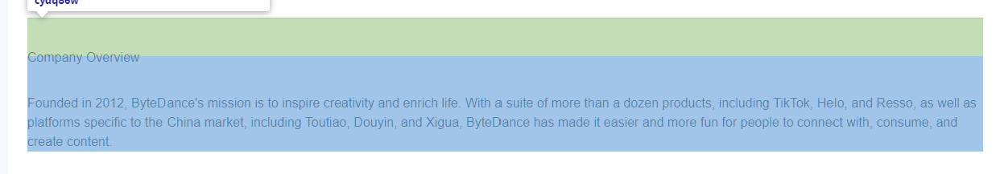

# README

Please do not use the file `webscrape_jobstreet_datascientist.py`. Its my earlier (and more embarrassing) work

As the content in the html tags change from time to time, if there is any break in the tags, please update the hydra config `hydra_config.yaml` file in the appropriate headers.

# Sample of the HTML Tags

The html tags are crucial in pulling the correct details and they will change occasionally.

Here are samples of them:

## small_section

Type: `div`
Found : Upper left corner

Covers the company's name, location and posting date

The correct tag should be "sx2jih0 zcydq86a"

## company_name

Type: `span`
Found: Upper left corner

This information is found in the same area as the small section above.
The correct tag should be "sx2jih0 zcydq84u es8sxo0 es8sxo2 es8sxo21 _1d0g9qk4 es8sxoa"

## add_info

Type: `div`
Found: Middle, just after Job Description

This captures all additional information including the `additional company information`

The correct tag should be  "sx2jih0 zcydq8n zcydq86q zcydq89q"

## company_overview

Type: `div`
Found: After the additional information section just beyond a horizontal bar

The correct tag should be  "sx2jih0 zcydq86q zcydq86v zcydq86w"

